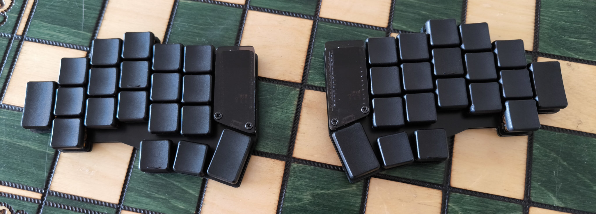

# Raven Split Keyboard

The Raven keyboard (rvkbd) is a wireless, low-profile, split keyboard based on the [Corne keyboard](https://github.com/foostan/crkbd) by foostan. It has a 3x5 column staggered layout with 3 thumb keys and 1 extra outer pinky key.

The goal of this project is to create a split layout with an aggressive, irregular stagger to match a sub-integer [2D:4D ratio](https://en.wikipedia.org/wiki/Digit_ratio) of approximately 0.925. The 38-key layout is a product of countless iterations on [my personal keymap](images/example-keymap.png), aiming to minimize finger movement and total keystrokes whilst maintaining a clean, logical distinction between layers.

## Microcontrollers

The Raven is designed to be entirely wireless and built with the [nice!nano microcontroller](https://nicekeyboards.com/nice-nano/). A full list of international stockists is available on their website.

> Sometimes the nice!nano can be hard to get but in theory the keyboard is compatible with any wireless controller with a Pro Micro footprint. One of the more common and well-reviewed nice!nano clones is the [Supermini NRF5284](https://www.aliexpress.com/item/1005006035505133.html).
>
> A comprehensive list of possible alternatives can be found [here](https://github.com/joric/nrfmicro/wiki/Alternatives). All of these options are untested and you might run into unforeseen complexities when using an alternative microcontroller.

## Keycaps

The PCB key-spacing is designed for 17x17mm keycaps with a 2mm border radius. I've read that standard Kailh keycaps are 17x18mm so will probably not fit without modification.

[Layout Preview](images/layout-preview.png)

The keyboard works best with Chosfox PBT keycaps which can be purchased from the [Mechanical Switch Store](https://www.aliexpress.com/item/1005004558099208.html) on AliExpress and shipped internationally. They also sell homing keys and 1.5U thumb keys [here](https://www.aliexpress.com/item/1005004780019538.html).

## Plates

Version 1 comes with [an edge-cuts gerber](raven-split-38key/raven-split-38key__choc-hotswap-n!n/pcb/gerber.zip  "download") intended to be cut from 1.2mm FR-4. Alternatively, an identical but untested DXF is included for lazer cutting other sheet materials.

> The plate should be exactly 1.2mm thick and fairly stiff to allow the low profile choc (v1) switches to attach easily and securely. The switches will slip out of a thicker plate more easily but the edges of the plate cuts are quite thin so the material needs to be very strong and not too brittle, e.g. carbon fibre or aluminum.

## Cases

Version 1 is not intended to be used with a case and does not include a case model of any kind nor the required mounting holes. Instead, the board rests directly on the hotswap sockets and uses rubber feet for grip and stability. This is an intentional decision intended to reduce the height of the board but probably reduces the durability of the final product.

If you want to use a case, I recommend adding several through-hole pads to the PCB file before having it fabricated. How you use those mounting holes and create the case itself is up to you. Common approaches include 3D-printing and making a layered case out of extra unprinted FR-4 or other lazer cut sheet materials.

## Required Components

Below is listed the minimum components required to assemble a single keyboard.

> It's important to have spares for if you make a mistake. Also, buying more units of a component gets much cheaper very quickly so don't be afraid to buy more than you need or aim to build two.

| | Component | Link |
|-|-----------|------|
| 2 | Raven keyboard PCBs | [Download Gerber](raven-split-38key/raven-split-38key__choc-hotswap-n!n/pcb/gerber.zip  "download") |
| 2 | Raven keyboard plates (1.2mm) | [Download Gerber](raven-split-38key/raven-split-38key__choc-hotswap-n!n/pcb/gerber.zip "download") |
| 2 | Compatible wireless microcontrollers | [Buy NRF52840 Supermini](https://www.aliexpress.com/w/wholesale-NRF52840-Supermini.html)   [Buy nice!nano v2](https://nicekeyboards.com/nice-nano) |
| 2 | 3x6 DIP TS-1136 reset button | [Buy TS-1136 DIP reset button](https://www.aliexpress.com/w/wholesale-TS%2525252d1136-DIP-button.html) |
| 2 | MSK-12C02 7-pin SMD power switch | [Buy MSK-12C02 power switch](https://www.aliexpress.com/w/wholesale-MSK%2525252d12C02-7%2525252dpin-SMD-toggle-switch.htmlf) |
| 36 | Kailh Choc (v1) switches | [Buy Choc (v1) switches](https://lowprokb.ca/collections/switches/products/sunset-tactile-choc-switches) |
| 36 | Choc low profile hot swap sockets | [Buy Choc (v1) hot swap sockets](https://www.kailhswitch.com/mechanical-keyboard-switches/box-switches/choc-type-hot-swap-socket.html) |
| 36 | 1N4148 SOD-123 SMD diodes | [Buy 1N4148 SMD diodes](https://www.aliexpress.com/w/wholesale-1N4148-SOD%2525252d123-SMD-diode.html) |
| 30 | 1u Chosfox low profile PBT keycaps | [Buy 1u keycaps](https://www.aliexpress.com/item/1005004558099208.html) |
| 4 | 1.5u Chosfox low profile PBT keycaps | [Buy 1.5u keycaps](https://www.aliexpress.com/item/1005004780019538.html) |
| 2 | 1u Chosfox homing keys | [Buy 1u homing keys](https://www.aliexpress.com/item/1005004780019538.html) |

> The Chosfox keycaps are 17x17mm and the key spacing on the PCB has been designed with that spacing in mind. I've read that the standard Kailh keycaps are is 1mm wider so it's probably wise to use these exact keycaps (unless you know what you're doing)

## Optional Components

You might want extra, optional components for socketing or adding a cover to the microcontroller, adding rubber feet or other details. I've included a separate list of those items here and their purposes to help you choose.

| | Component | Reason |
|-|-----------|--------|
| 4 | 12-pin female sockets | Socketing the microcontroller means it can be replaced if it breaks or you make a mistake installing it. Without sockets, an issue like that might require a full rebuild or difficult de-soldering job. There are a few different options but I use the lowest profile variety and cut the legs off thru-hole diodes to serve as male pins from the PCB. |
| 4 to 60 | 2mm+ sticky rubber feet | Without a case, adding rubber feet directly to the bottom of the PCB stops it moving around on the table. The more feet the better because it adds weight, protects the components underneath and allows it to sit stable on less flat surfaces. |
| 2 | 2–3mm acrylic covers | Adding covers to the microcontroller hides them and provides protection. I manually fabricated my own but you could lazer cut the required shape. I haven't yet created a DXF for that component but may in the future. |
| 4 | M2 8mm stand-offs | To hold the cover the correct distance from the PCB, small double-sided stand-offs are needed. With the low profile sockets, I needed 6 or 8mm long stand-offs, but that will vary based on exactly how you solder the microcontroller. |
| 8 | M2 6mm wafer head bolts | Attaching the stand-offs needs flat wafer bolts, both to reduce protrusion on the underside and also to avoid cracking the acrylic covers. DO NOT over-tighten! |

To assemble the keyboard you will need several, specific tools. I'll add a full list here once I've completed the build guide.
