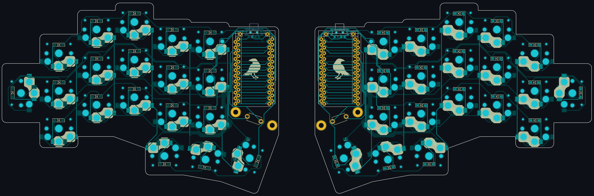

# Raven Split Keyboard

The Raven keyboard (rvkbd) is a wireless, low-profile, split keyboard based on the [Corne keyboard](https://github.com/foostan/crkbd) by foostan. It has a 3x5 column staggered layout with 3 thumb keys and 1 extra outer pinky key.

The goal of this project is to create a split layout with an aggressive, irregular stagger to match a sub-integer [2D:4D ratio](https://en.wikipedia.org/wiki/Digit_ratio) of approximately 0.925. The 38-key layout is a product of countless iterations on [my personal keymap](images/example-keymap.png), aiming to minimize finger movement and total keystrokes whilst maintaining a clean, logical distinction between layers.

<h3 align="center" style="margin-top: 5rem">
  <a href="raven-split-38key/raven-split-38key__choc-hotswap-n!n/BUILD_GUIDE.md">
    🛠️ Version 1 Build Guide 🛠️
  </a>
</h3>

## Example Keymap

## Microcontrollers

The Raven is designed to be entirely wireless and built with the [nice!nano microcontroller](https://nicekeyboards.com/nice-nano/). A full list of international stockists is available on their website.

The keyboard is compatible with any wireless controller with a Pro Micro footprint. One of the best-received and easiest to obtain nice!nano clones is the [Supermini NRF5284](https://www.aliexpress.com/item/1005006035505133.html) which has been tested with this keyboard and works as expected.

> A comprehensive list of possible alternatives can be found [here](https://github.com/joric/nrfmicro/wiki/Alternatives). Most of these options are untested and you might run into unforeseen complexities when using an alternative microcontroller.

## Keycaps

The PCB key-spacing is designed for 17x17mm keycaps with a 2mm border radius. I've read that standard Kailh keycaps are 17x18mm so will probably not fit without modification.

The keyboard works best with Chosfox PBT keycaps which can be purchased from the [Mechanical Switch Store](https://www.aliexpress.com/item/1005004558099208.html) on AliExpress and shipped internationally. They also sell homing keys and 1.5U thumb keys [here](https://www.aliexpress.com/item/1005004780019538.html).

## Plate

Version 1 comes with [an edge-cuts gerber](raven-split-38key/raven-split-38key__choc-hotswap-n!n/pcb/gerber.zip  "download") intended to be cut from 1.2mm FR-4. Alternatively, an identical but untested DXF is included for lazer cutting other sheet materials.

> The plate should be exactly 1.2mm thick and fairly stiff to allow the low profile choc (v1) switches to attach easily and securely. The switches will slip out of a thicker plate more easily but the edges of the plate cuts are quite thin so the material needs to be very strong and not too brittle, e.g. carbon fibre or aluminum.

## Case

Version 1 is not intended to be used with a case and does not include a case model of any kind nor the required mounting holes. Instead, the board rests directly on the hotswap sockets and uses rubber feet for grip and stability. This is an intentional decision intended to reduce the height of the board but probably reduces the durability of the final product.

> If you want to use a case, I recommend adding several through-hole pads to the PCB file before having it fabricated. How you use those mounting holes and create the case itself is up to you. Common approaches include 3D-printing and making a layered case out of extra unprinted FR-4 or other lazer cut sheet materials.

## Firmware

The Raven uses [ZMK](https://zmk.dev/docs) for firmware. Because the PCB shares a wiring schematic with the Corne keyboard, it can be loaded with any existing 3x6 Corne configuration.

> Any repurposed Corne 3x6 keymap will be missing the outermost top and bottom keys due to the difference in physical layout. Any key mappings in these positions will not be accessible on the Raven.

If you want to customize the layout or create your own config, I have created a [custom shield and config repo](https://github.com/joelove/rvkbd-zmk-config). Just fork the repo and use the layout editor in the README to quickly and easily design your own.

> Flashable firmware artifacts can be found in the repo _Actions_ tab, just download them then hit the reset key twice on each half and drag each firmware file onto the "NICENANO" drive that appears.
