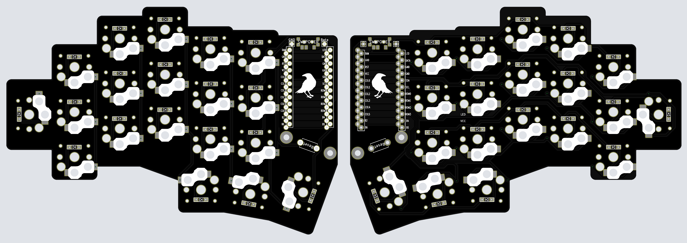
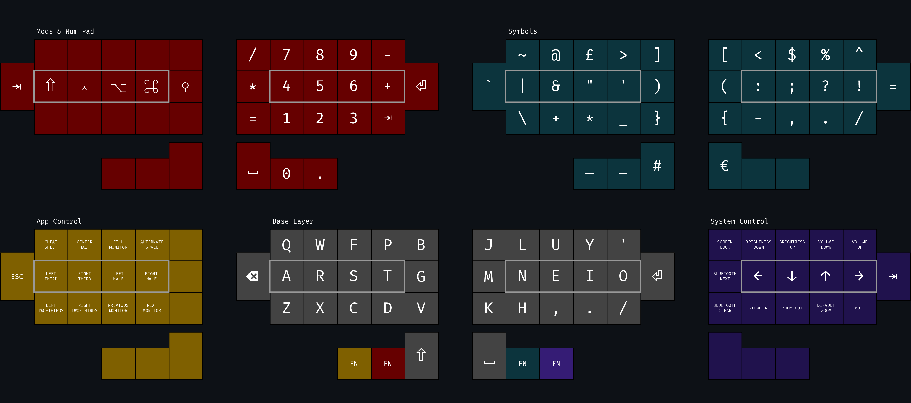

# Raven Split Keyboard

The Raven keyboard (rvkbd) is a wireless, low-profile, split keyboard based on the [Corne keyboard](https://github.com/foostan/crkbd) by foostan. It has a 3x5 column staggered layout with 3 thumb keys and 1 outer pinky key.

---

---

The goal of this project is to create a split layout with an aggressive, irregular stagger to match a sub-integer [2D:4D ratio](https://en.wikipedia.org/wiki/Digit_ratio) of approximately 0.925. The 38-key layout is a product of countless iterations on my personal keymap, aiming to minimize finger movement and total keystrokes whilst maintaining a clean, logical distinction between layers.

---

---

## Assembly Information

#### Microcontrollers

The Raven is designed to be entirely wireless and built with the [nice!nano microcontroller](https://nicekeyboards.com/nice-nano/). A full list of international stockists is available on their website.

Sometimes the nice!nano can be hard to get but in theory the keyboard is compatible with any wireless controller with a Pro Micro footprint. One of the more common and well-reviewed nice!nano clones is the [Supermini NRF5284](https://www.aliexpress.com/item/1005006035505133.html).

A comprehensive list of possible alternatives can be found [here](https://github.com/joric/nrfmicro/wiki/Alternatives). All of these options are untested and you might run into unforeseen complexities when using an alternative microcontroller.

#### Keycaps

The PCB key-spacing is designed for 17x17mm keycaps with a 2mm border radius. I've read that standard Kailh keycaps are 17x18mm so will probably not fit without modification.

The keyboard works best with Chocfox PBT keycaps which can be purchased from the [Mechanical Switch Store](https://www.aliexpress.com/item/1005004558099208.html) on AliExpress and shipped internationally. They also sell homing keys and 1.5U thumb keys [here](https://www.aliexpress.com/item/1005004780019538.html).

---

---

#### Cases

As it stands, this PCB is not intended to be used with a case and does not include mounting holes or a case model of any kind. Instead, the board rests directly on the hotswap sockets on the desk and uses rubber feet as required. This is a personal preference to reduce the height of the board but definitely reduces the robustness of the final product.

If you want to use a case, I recommend adding several through-hole pads to the PCB file before having it cut and printed. How you use those mounting holes and create the case itself is up to you. Common approaches include 3D-printing and making a layered case out of extra unprinted boards or laser-cut plastic.
